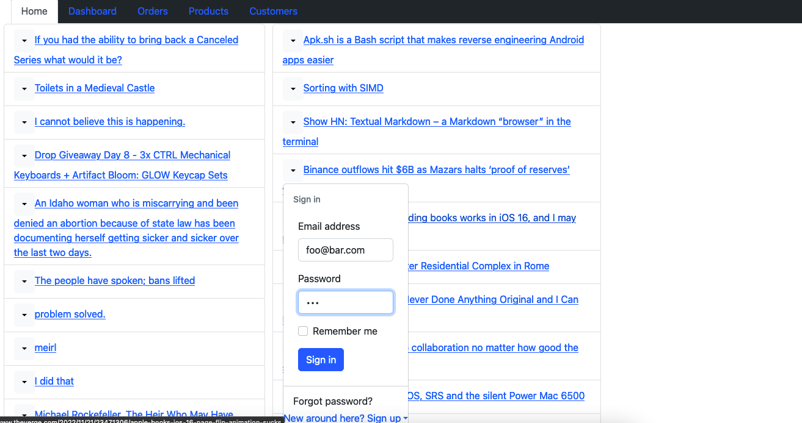

# dashboard
social media dashboard

# rss_dashboard

## requirements 
 - React
 - Rails API
 - Redux
 - bootstrap
 - Rack as middleware
## API used
 - "reddit"
 - "hackerNews"

# Usage
Retrieves the fron page RSS feed from Reddit and HackerNews. 

# preview

